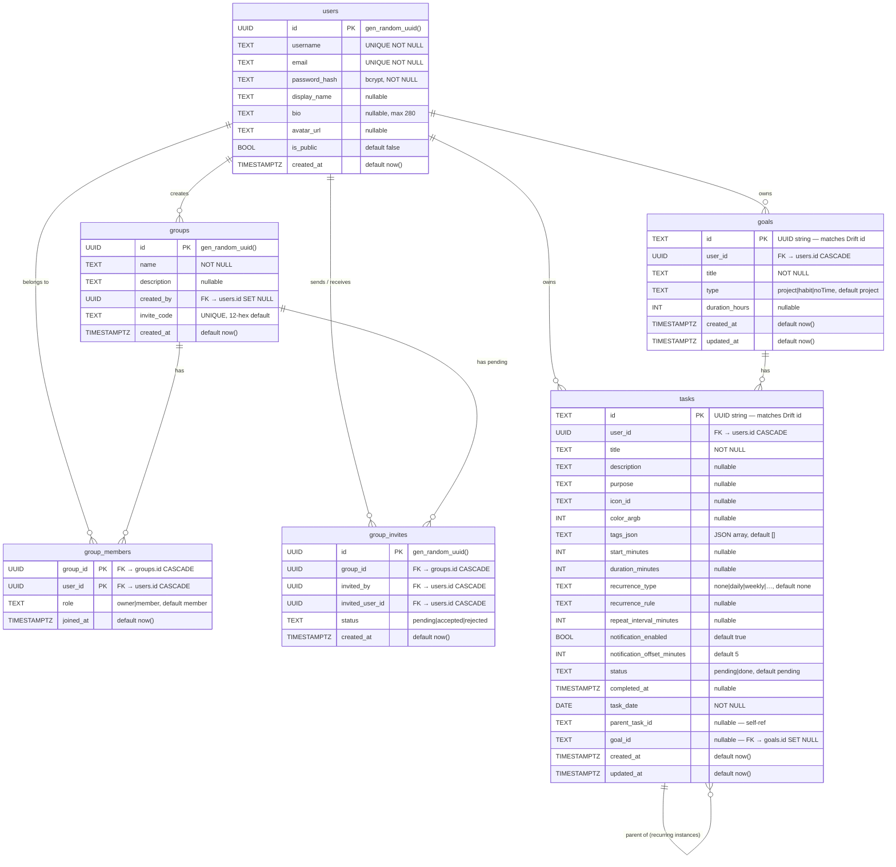

# TaskStack — Entity-Relationship Diagram

> **Two schemas coexist in TaskStack:**
> - **Local (SQLite / Drift)** — offline task data on-device
> - **Cloud (Postgres / Aiven)** — auth, social groups, and profiles

---

## Local Schema (SQLite via Drift)

> Source: `lib/database/tables/` + `lib/database/app_database.dart` (schema v3).

---

## Cloud Schema (Postgres / Aiven)

> Source: `backend/db/schema.sql`. Powered by `pgcrypto` UUIDs.

---

## Relationships & Notes

### Local (Drift / SQLite)

| Relationship | Type | Description |
|---|---|---|
| `goals` → `tasks` | One-to-many | A goal can have many tasks; `tasks.goalId` is a nullable FK |
| `tasks` → `tasks` | Self-referencing | `tasks.parentTaskId` links recurring instances to their template |
| `tasks` ↔ `tags` | Denormalised | Tags stored inline as JSON array (`tagsJson`); `tags` table holds the master tag registry |
| `daily_summaries` | Standalone | Materialised analytics cache keyed by date; no FK |

### Cloud (Postgres / Aiven)

| Relationship | Type | Description |
|---|---|---|
| `users` → `groups` | One-to-many | `groups.created_by` tracks group creator |
| `users` ↔ `groups` | Many-to-many | Via `group_members` pivot (composite PK prevents duplicates) |
| `users` ↔ `group_invites` | One-to-many | Both `invited_by` and `invited_user_id` are user FKs |
| `groups` → `group_invites` | One-to-many | `UNIQUE(group_id, invited_user_id)` prevents duplicate invites |
| `users` → `goals` | One-to-many | `goals.user_id` scopes goals to their owner (CASCADE delete) |
| `users` → `tasks` | One-to-many | `tasks.user_id` scopes tasks to their owner (CASCADE delete) |
| `goals` → `tasks` | One-to-many | `tasks.goal_id` FK mirrors local relationship |
| `tasks` → `tasks` | Self-referencing | `tasks.parent_task_id` links recurring instances to template |

### Tag Storage Strategy

Tags use a **hybrid model**:
- `tags` table — master registry of tag names + colours (tag picker UI)
- `tasks.tagsJson` — denormalised copy of tag strings per task (fast reads, no join)

This means task queries never need a join to retrieve tags, at the cost of tag renames requiring a bulk update across all tasks.

---

## Schema Version History

| Version | Schema | Change |
|---|---|---|
| 1 | Local | Initial: `tasks`, `tags`, `daily_summaries` |
| 2 | Local | Added `tasks.graphicImage` column |
| 3 | Local | Added `goals` table + `tasks.goalId` column |
| 4 | Cloud | Initial cloud schema: `users`, `groups`, `group_members`, `group_invites` |
| 5 | Cloud | Phase 10: added `goals` + `tasks` tables (user-scoped mirrors of Drift schema) |
