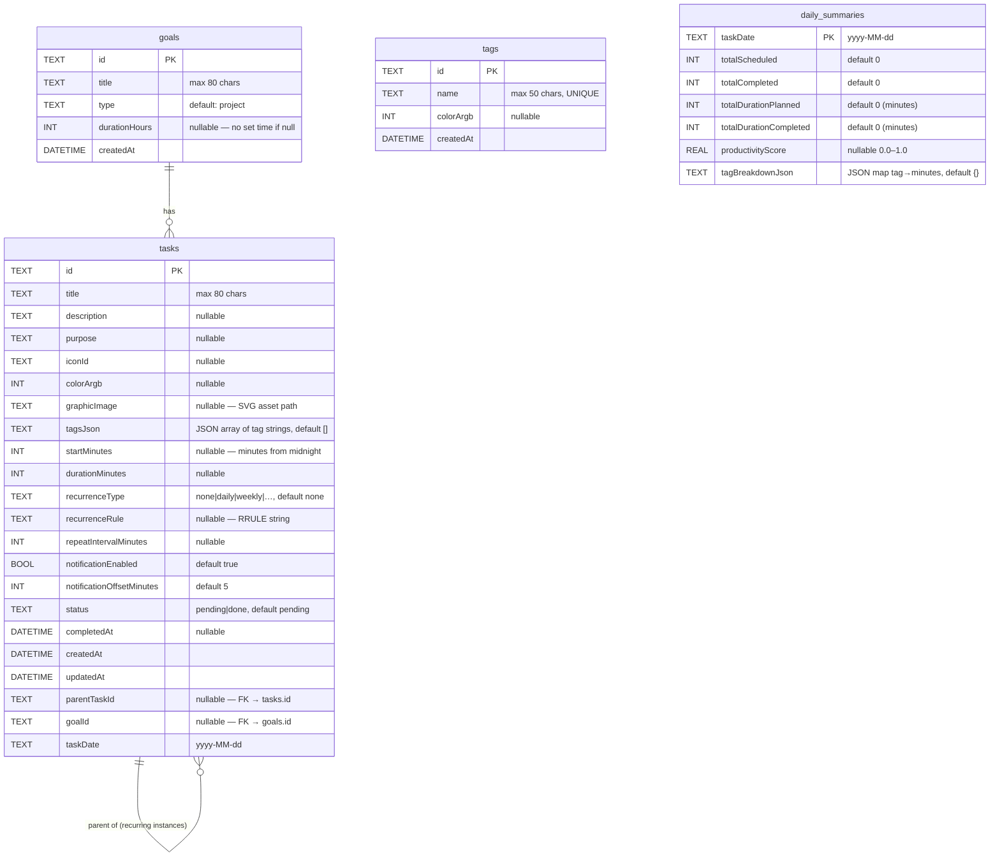

# TaskStack — Entity-Relationship Diagram

> **Source of truth:** Generated from the Drift table definitions in  
> `lib/database/tables/` and `lib/database/app_database.dart` (schema v3).

---

## ER Diagram

---

## Relationships & Notes

| Relationship | Type | Description |
|---|---|---|
| `goals` → `tasks` | One-to-many | A goal can have many tasks; `tasks.goalId` is a nullable FK |
| `tasks` → `tasks` | Self-referencing | `tasks.parentTaskId` links recurring instances to their template |
| `tasks` ↔ `tags` | Denormalised | Tags are stored inline as a JSON array (`tagsJson`); the `tags` table holds the master list of user-defined tags with colours |
| `daily_summaries` | Standalone | Materialised analytics cache keyed by date; computed from `tasks`, no FK |

### Tag Storage Strategy

Tags use a **hybrid model**:
- `tags` table — master registry of tag names + colours (for the tag picker UI)
- `tasks.tagsJson` — denormalised copy of tag strings per task (fast reads, no join)

This means task queries never need a join to retrieve tags, at the cost of tag renames requiring a bulk update across all tasks.

### Recurring Tasks

Recurring instances are created as separate rows each with:
- `parentTaskId` pointing to the original/template task
- Their own `taskDate`
- Their own `status` / `completedAt`

This allows per-instance completion without affecting the template or siblings.

---

## Schema Version History

| Version | Change |
|---|---|
| 1 | Initial: `tasks`, `tags`, `daily_summaries` |
| 2 | Added `tasks.graphicImage` column |
| 3 | Added `goals` table + `tasks.goalId` column |
